# d-design-product-architecture

<!-- Generated by scripts/generate_docs.py. Do not edit by hand. -->

## Summary

Create or evolve an approved product architecture baseline from an approved Project Context and Product Requirements. Use after c-manage-product-requirements for initial releases or approved increments that need architectural work. Produce an English arc42 architecture document, concise C4 views in Structurizr DSL, Docker viewing instructions, one documentation folder per internal container, selective ADRs, explicit product-behavior provenance, requirement-to-architecture coverage, deterministic validation, guarded traceability updates, and a human approval gate. After approval, route to e-sync-repository-requirements when repository issue reconciliation is needed, then to f-establish-technical-foundation until the foundation is complete, and only then to the future implementation workflow when one exists. Do not create source-code scaffolding, repository issues, implementation plans, runtime artifacts, or silent product decisions.

## Repository Source

- [Canonical SKILL.md](https://github.com/ecarrenolozano/ai-sdlc-skills/blob/main/skills/d-design-product-architecture/SKILL.md)
- [Skill directory](https://github.com/ecarrenolozano/ai-sdlc-skills/tree/main/skills/d-design-product-architecture)

## Resource Overview

| Resource type | Files |
| --- | ---: |
| agents | 1 |
| references | 25 |
| scripts | 13 |
| assets | 0 |

## Operating Process

Multiple process flowchart files exist. The documentation renders `references/process_flowchart.md` first.

Source: [references/process_flowchart.md](https://github.com/ecarrenolozano/ai-sdlc-skills/blob/main/skills/d-design-product-architecture/references/process_flowchart.md)

## Product Architecture Design Flowchart

```mermaid
flowchart TD
    S01[1. Locate repository and inputs] --> S02[2. Read Project Context]
    S02 --> S03[3. Read Product Requirements]
    S03 --> S04[4. Read Workflow Traceability]
    S04 --> S05{5. Project Context approved?}
    S05 -->|No| S51[51. Stop without trace changes]
    S05 -->|Yes| S06{6. Product Requirements approved?}
    S06 -->|No| S51
    S06 -->|Yes| S07{7. Zero requirement questions?}
    S07 -->|No| S51
    S07 -->|Yes| S08{8. Initial requirements complete?}
    S08 -->|No| S51
    S08 -->|Yes| S09[9. Detect Architecture row]
    S09 --> S10[10. Classify run]
    S10 --> S11[11. Read existing architecture]
    S11 --> S12[12. Extract capabilities and stories]
    S12 --> S13[13. Extract constraints and quality drivers]
    S13 --> S14[14. Extract context, data, and deployment evidence]
    S14 --> S15[15. Separate facts, decisions, constraints, and open decisions]
    S15 --> S16{16. Material decisions open?}
    S16 -->|Yes| S17[17. Ask first material question round]
    S17 --> S18[18. Set Under Clarification]
    S18 --> S52[52. Initialize trace transaction]
    S16 -->|No| S19[19. Define minimum container set]
    S19 --> S20[20. Reject unsupported containers]
    S20 --> S21[21. Normalize container folders]
    S21 --> S22[22. Update architecture README]
    S22 --> S23[23. Update diagrams gitignore]
    S23 --> S24[24. Update root arc42 document]
    S24 --> S25[25. Add viewing instructions]
    S25 --> S26[26. Preserve twelve arc42 sections]
    S26 --> S27[27. Populate sections proportionally]
    S27 --> S28[28. Explain non-applicable content]
    S28 --> S29[29. Create container folders]
    S29 --> S30[30. Update container documents]
    S30 --> S31[31. Identify material internal boundaries]
    S31 --> S32[32. Update workspace.dsl]
    S32 --> S33[33. Create context and container views]
    S33 --> S34[34. Add required Component views]
    S34 --> S35[35. Add selected Dynamic views]
    S35 --> S36[36. Add relevant Deployment view]
    S36 --> S37[37. Update Docker Compose]
    S37 --> S38[38. Declare stable view keys]
    S38 --> S39[39. Keep diagram text concise]
    S39 --> S40[40. Embed only existing images]
    S40 --> S41[41. Update ADRs]
    S41 --> S42[42. Link ADRs]
    S42 --> S43[43. Remove templates and runtime artifacts]
    S43 --> S44[44. Map every capability]
    S44 --> S45[45. Verify every story]
    S45 --> S46[46. Verify product behavior provenance]
    S46 --> S47[47. Record risks and uncertainty]
    S47 --> S48[48. Run unsynchronized validation]
    S48 --> S49[49. Write exact validation report]
    S49 --> S50{50. Synchronized validation passes?}
    S50 -->|No| S51
    S50 -->|Yes| S52
    S52 --> S53[53. Edit proposed trace copy]
    S53 --> S54{54. Trace guard passes?}
    S54 -->|No| S51
    S54 -->|Yes| S55[55. Commit trace transaction]
    S55 --> S56[56. Present architecture summary]
    S56 --> S57{57. Material information missing?}
    S57 -->|Yes| S66[66. Report changes and omissions]
    S57 -->|No| S58[58. Set Pending Approval]
    S58 --> S59[59. Request explicit review record]
    S59 --> S60{60. Corrections requested?}
    S60 -->|Yes| S61[61. Rerun all validators]
    S61 --> S56
    S60 -->|No| S62[62. Record explicit approval]
    S62 --> S63{63. Essential ADRs accepted?}
    S63 -->|No| S59
    S63 -->|Yes| S64[64. Set Architecture Complete]
    S64 --> S65[65. Choose e-sync, foundation, or future implementation handoff]
    S65 --> S66
    S66 --> S67[67. Do not invoke e-sync-repository-requirements]
```



## Validation Scripts

- [scripts/run_regression_tests.py](https://github.com/ecarrenolozano/ai-sdlc-skills/blob/main/skills/d-design-product-architecture/scripts/run_regression_tests.py)
- [scripts/trace_transaction.py](https://github.com/ecarrenolozano/ai-sdlc-skills/blob/main/skills/d-design-product-architecture/scripts/trace_transaction.py)
- [scripts/validate_arc42_structure.py](https://github.com/ecarrenolozano/ai-sdlc-skills/blob/main/skills/d-design-product-architecture/scripts/validate_arc42_structure.py)
- [scripts/validate_architecture_hygiene.py](https://github.com/ecarrenolozano/ai-sdlc-skills/blob/main/skills/d-design-product-architecture/scripts/validate_architecture_hygiene.py)
- [scripts/validate_architecture_package.py](https://github.com/ecarrenolozano/ai-sdlc-skills/blob/main/skills/d-design-product-architecture/scripts/validate_architecture_package.py)
- [scripts/validate_container_structure.py](https://github.com/ecarrenolozano/ai-sdlc-skills/blob/main/skills/d-design-product-architecture/scripts/validate_container_structure.py)
- [scripts/validate_diagram_documentation.py](https://github.com/ecarrenolozano/ai-sdlc-skills/blob/main/skills/d-design-product-architecture/scripts/validate_diagram_documentation.py)
- [scripts/validate_docker_compose.py](https://github.com/ecarrenolozano/ai-sdlc-skills/blob/main/skills/d-design-product-architecture/scripts/validate_docker_compose.py)
- [scripts/validate_product_behavior_discipline.py](https://github.com/ecarrenolozano/ai-sdlc-skills/blob/main/skills/d-design-product-architecture/scripts/validate_product_behavior_discipline.py)
- [scripts/validate_skill_identifier_discipline.py](https://github.com/ecarrenolozano/ai-sdlc-skills/blob/main/skills/d-design-product-architecture/scripts/validate_skill_identifier_discipline.py)
- [scripts/validate_structurizr_model.py](https://github.com/ecarrenolozano/ai-sdlc-skills/blob/main/skills/d-design-product-architecture/scripts/validate_structurizr_model.py)
- [scripts/validate_trace_mutation.py](https://github.com/ecarrenolozano/ai-sdlc-skills/blob/main/skills/d-design-product-architecture/scripts/validate_trace_mutation.py)
- [scripts/validate_workflow_alignment.py](https://github.com/ecarrenolozano/ai-sdlc-skills/blob/main/skills/d-design-product-architecture/scripts/validate_workflow_alignment.py)

## Reference Material

- [references/adr-template.md](https://github.com/ecarrenolozano/ai-sdlc-skills/blob/main/skills/d-design-product-architecture/references/adr-template.md)
- [references/arc42-guidance.md](https://github.com/ecarrenolozano/ai-sdlc-skills/blob/main/skills/d-design-product-architecture/references/arc42-guidance.md)
- [references/architecture-readme-template.md](https://github.com/ecarrenolozano/ai-sdlc-skills/blob/main/skills/d-design-product-architecture/references/architecture-readme-template.md)
- [references/architecture-template.md](https://github.com/ecarrenolozano/ai-sdlc-skills/blob/main/skills/d-design-product-architecture/references/architecture-template.md)
- [references/c4-structurizr-guidance.md](https://github.com/ecarrenolozano/ai-sdlc-skills/blob/main/skills/d-design-product-architecture/references/c4-structurizr-guidance.md)
- [references/container-architecture-template.md](https://github.com/ecarrenolozano/ai-sdlc-skills/blob/main/skills/d-design-product-architecture/references/container-architecture-template.md)
- [references/golden-example/README.md](https://github.com/ecarrenolozano/ai-sdlc-skills/blob/main/skills/d-design-product-architecture/references/golden-example/README.md)
- [references/golden-example/browser-task-board/README.md](https://github.com/ecarrenolozano/ai-sdlc-skills/blob/main/skills/d-design-product-architecture/references/golden-example/browser-task-board/README.md)
- [references/golden-example/browser-task-board/adr/ADR-001-browser-local-persistence-boundary.md](https://github.com/ecarrenolozano/ai-sdlc-skills/blob/main/skills/d-design-product-architecture/references/golden-example/browser-task-board/adr/ADR-001-browser-local-persistence-boundary.md)
- [references/golden-example/browser-task-board/adr/ADR-002-separate-browser-frontend-from-flask-backend.md](https://github.com/ecarrenolozano/ai-sdlc-skills/blob/main/skills/d-design-product-architecture/references/golden-example/browser-task-board/adr/ADR-002-separate-browser-frontend-from-flask-backend.md)
- [references/golden-example/browser-task-board/adr/ADR-003-localhost-only-personal-deployment.md](https://github.com/ecarrenolozano/ai-sdlc-skills/blob/main/skills/d-design-product-architecture/references/golden-example/browser-task-board/adr/ADR-003-localhost-only-personal-deployment.md)
- [references/golden-example/browser-task-board/adr/README.md](https://github.com/ecarrenolozano/ai-sdlc-skills/blob/main/skills/d-design-product-architecture/references/golden-example/browser-task-board/adr/README.md)
- [references/golden-example/browser-task-board/containers/browser-frontend/architecture.md](https://github.com/ecarrenolozano/ai-sdlc-skills/blob/main/skills/d-design-product-architecture/references/golden-example/browser-task-board/containers/browser-frontend/architecture.md)
- [references/golden-example/browser-task-board/containers/flask-backend/architecture.md](https://github.com/ecarrenolozano/ai-sdlc-skills/blob/main/skills/d-design-product-architecture/references/golden-example/browser-task-board/containers/flask-backend/architecture.md)
- [references/golden-example/browser-task-board/containers/persistence-mechanism/architecture.md](https://github.com/ecarrenolozano/ai-sdlc-skills/blob/main/skills/d-design-product-architecture/references/golden-example/browser-task-board/containers/persistence-mechanism/architecture.md)
- [references/golden-example/browser-task-board/diagrams/.gitignore](https://github.com/ecarrenolozano/ai-sdlc-skills/blob/main/skills/d-design-product-architecture/references/golden-example/browser-task-board/diagrams/.gitignore)
- [references/golden-example/browser-task-board/diagrams/docker-compose.yml](https://github.com/ecarrenolozano/ai-sdlc-skills/blob/main/skills/d-design-product-architecture/references/golden-example/browser-task-board/diagrams/docker-compose.yml)
- [references/golden-example/browser-task-board/diagrams/workspace.dsl](https://github.com/ecarrenolozano/ai-sdlc-skills/blob/main/skills/d-design-product-architecture/references/golden-example/browser-task-board/diagrams/workspace.dsl)
- [references/golden-example/browser-task-board/in-product-requirements.md](https://github.com/ecarrenolozano/ai-sdlc-skills/blob/main/skills/d-design-product-architecture/references/golden-example/browser-task-board/in-product-requirements.md)
- [references/golden-example/browser-task-board/in-project-context.md](https://github.com/ecarrenolozano/ai-sdlc-skills/blob/main/skills/d-design-product-architecture/references/golden-example/browser-task-board/in-project-context.md)
- [references/golden-example/browser-task-board/out-architecture.md](https://github.com/ecarrenolozano/ai-sdlc-skills/blob/main/skills/d-design-product-architecture/references/golden-example/browser-task-board/out-architecture.md)
- [references/golden-example/browser-task-board/out-trace-workflow.md](https://github.com/ecarrenolozano/ai-sdlc-skills/blob/main/skills/d-design-product-architecture/references/golden-example/browser-task-board/out-trace-workflow.md)
- [references/process-flowchart.md](https://github.com/ecarrenolozano/ai-sdlc-skills/blob/main/skills/d-design-product-architecture/references/process-flowchart.md)
- [references/process_flowchart.md](https://github.com/ecarrenolozano/ai-sdlc-skills/blob/main/skills/d-design-product-architecture/references/process_flowchart.md)
- [references/traceability-row-patterns.md](https://github.com/ecarrenolozano/ai-sdlc-skills/blob/main/skills/d-design-product-architecture/references/traceability-row-patterns.md)

## Agent Configuration

- [agents/openai.yaml](https://github.com/ecarrenolozano/ai-sdlc-skills/blob/main/skills/d-design-product-architecture/agents/openai.yaml)

## Assets

No files.

## Golden Examples

- [references/golden-example/README.md](https://github.com/ecarrenolozano/ai-sdlc-skills/blob/main/skills/d-design-product-architecture/references/golden-example/README.md)
- [references/golden-example/browser-task-board/README.md](https://github.com/ecarrenolozano/ai-sdlc-skills/blob/main/skills/d-design-product-architecture/references/golden-example/browser-task-board/README.md)
- [references/golden-example/browser-task-board/adr/ADR-001-browser-local-persistence-boundary.md](https://github.com/ecarrenolozano/ai-sdlc-skills/blob/main/skills/d-design-product-architecture/references/golden-example/browser-task-board/adr/ADR-001-browser-local-persistence-boundary.md)
- [references/golden-example/browser-task-board/adr/ADR-002-separate-browser-frontend-from-flask-backend.md](https://github.com/ecarrenolozano/ai-sdlc-skills/blob/main/skills/d-design-product-architecture/references/golden-example/browser-task-board/adr/ADR-002-separate-browser-frontend-from-flask-backend.md)
- [references/golden-example/browser-task-board/adr/ADR-003-localhost-only-personal-deployment.md](https://github.com/ecarrenolozano/ai-sdlc-skills/blob/main/skills/d-design-product-architecture/references/golden-example/browser-task-board/adr/ADR-003-localhost-only-personal-deployment.md)
- [references/golden-example/browser-task-board/adr/README.md](https://github.com/ecarrenolozano/ai-sdlc-skills/blob/main/skills/d-design-product-architecture/references/golden-example/browser-task-board/adr/README.md)
- [references/golden-example/browser-task-board/containers/browser-frontend/architecture.md](https://github.com/ecarrenolozano/ai-sdlc-skills/blob/main/skills/d-design-product-architecture/references/golden-example/browser-task-board/containers/browser-frontend/architecture.md)
- [references/golden-example/browser-task-board/containers/flask-backend/architecture.md](https://github.com/ecarrenolozano/ai-sdlc-skills/blob/main/skills/d-design-product-architecture/references/golden-example/browser-task-board/containers/flask-backend/architecture.md)
- [references/golden-example/browser-task-board/containers/persistence-mechanism/architecture.md](https://github.com/ecarrenolozano/ai-sdlc-skills/blob/main/skills/d-design-product-architecture/references/golden-example/browser-task-board/containers/persistence-mechanism/architecture.md)
- [references/golden-example/browser-task-board/diagrams/.gitignore](https://github.com/ecarrenolozano/ai-sdlc-skills/blob/main/skills/d-design-product-architecture/references/golden-example/browser-task-board/diagrams/.gitignore)
- [references/golden-example/browser-task-board/diagrams/docker-compose.yml](https://github.com/ecarrenolozano/ai-sdlc-skills/blob/main/skills/d-design-product-architecture/references/golden-example/browser-task-board/diagrams/docker-compose.yml)
- [references/golden-example/browser-task-board/diagrams/workspace.dsl](https://github.com/ecarrenolozano/ai-sdlc-skills/blob/main/skills/d-design-product-architecture/references/golden-example/browser-task-board/diagrams/workspace.dsl)
- [references/golden-example/browser-task-board/in-product-requirements.md](https://github.com/ecarrenolozano/ai-sdlc-skills/blob/main/skills/d-design-product-architecture/references/golden-example/browser-task-board/in-product-requirements.md)
- [references/golden-example/browser-task-board/in-project-context.md](https://github.com/ecarrenolozano/ai-sdlc-skills/blob/main/skills/d-design-product-architecture/references/golden-example/browser-task-board/in-project-context.md)
- [references/golden-example/browser-task-board/out-architecture.md](https://github.com/ecarrenolozano/ai-sdlc-skills/blob/main/skills/d-design-product-architecture/references/golden-example/browser-task-board/out-architecture.md)
- [references/golden-example/browser-task-board/out-trace-workflow.md](https://github.com/ecarrenolozano/ai-sdlc-skills/blob/main/skills/d-design-product-architecture/references/golden-example/browser-task-board/out-trace-workflow.md)

## Canonical Skill Definition

The following section is generated from the canonical `SKILL.md` body.


## Product Architecture Design

### Purpose

Create the smallest architecture baseline sufficient to guide implementation, control material technical risk, and preserve traceability to approved product scope. Use the official arc42 section order for the root narrative, C4 for architectural views, Structurizr DSL as the canonical diagram model, and Architecture Decision Records for consequential decisions.

### Governing Rules

- Work in English.
- Treat `sdlc_docs/00_inception/project_context.md`, `sdlc_docs/01_requirements/product_requirements.md`, and `sdlc_docs/trace_workflow.md` as authoritative inputs.
- Start only when Project Context and Product Requirements are approved, unresolved requirement questions equal zero, and Initial requirements are `Complete`.
- Never change approved Project Context or Product Requirements.
- When evolving an approved architecture after a product change, preserve the prior approved architecture baseline and ADR history as self-contained current documentation with status and replacement relationship metadata. Do not replace a prior approved baseline with only a summary or require readers to recover approved architecture decisions from git history.
- Preserve all twelve official arc42 root sections and their order. Use `references/arc42-guidance.md` and `references/architecture-template.md`.
- Keep workflow extensions outside the numbered arc42 sections.
- Create or update `sdlc_docs/02_architecture/README.md`; it must identify `d-design-product-architecture` and accurately describe the views that exist.
- Use `sdlc_docs/02_architecture/diagrams/workspace.dsl` as the canonical C4 model.
- Create System Context and Container views for every initial baseline.
- Add a Component view when a material ADR depends on an internal boundary or internal responsibility split. Add other Component, Dynamic, or Deployment views only when they answer a material question.
- Keep C4 element descriptions concise. Keep person-to-system and person-to-container relationship labels intention-level; do not enumerate user stories or CRUD actions in diagram labels.
- Create one folder under `sdlc_docs/02_architecture/containers/` for every internal C4 container and create `architecture.md` inside it.
- Do not create a container folder for a person, external software system, deployment node, or component.
- Create deeper `components/`, `data/`, or `diagrams/` folders only when real content justifies them. Never create empty speculative hierarchy.
- Create architecture documentation folders, not product source-code folders. Do not create `frontend/src`, `backend/app`, framework scaffolding, production Dockerfiles, tests, or implementation modules.
- Do not infer a backend merely because the product has a browser interface and persistence. Ask a material question when multiple architecture options remain plausible.
- Classify architecture information as `Confirmed requirement`, `Confirmed architect decision`, `Internal architecture constraint`, `Open decision`, or `Not applicable`.
- Use `Confirmed architect decision`, not `Approved decision`, before the complete architecture baseline receives human approval.
- Never introduce user-visible behavior, acceptance conditions, or quality thresholds that are absent from approved Product Requirements. Route such proposals back to `c-manage-product-requirements` or report them as requirement feedback outside the approved baseline.
- Do not retain `Proposed` product-facing behavior in a baseline submitted for approval.
- Create ADRs only for significant, long-lived, risky, expensive, or hard-to-reverse decisions. Store them under `sdlc_docs/02_architecture/adr/`.
- Keep reusable ADR templates inside the skill only. Do not copy `ADR-000-template.md`, `TEMPLATE.md`, or any blank ADR template into the project architecture directory.
- Include `How to View This Architecture` before arc42 section 1. Explain how to run Structurizr with Docker Compose from the repository root.
- Create `sdlc_docs/02_architecture/diagrams/.gitignore` containing `.structurizr/` so Structurizr indexes, logs, locks, caches, and thumbnails are never versioned.
- Never create or retain `.structurizr/` inside the architecture package. Do not create `workspace.json`; preserve it only when an architect intentionally keeps layout data, while `workspace.dsl` remains canonical.
- Treat exported SVG or PNG diagrams as optional derivatives. Embed an image only when the file exists. Never create or reference a placeholder image.
- Do not start Docker, pull images, export diagrams, or claim rendering success during an ordinary run unless the user explicitly requests it.
- Map every approved `CAP-NNN` to an architecture element or an explicit justified disposition.
- Do not invent `CAP-NNN`, `US-NNN`, or product behavior absent from Product Requirements.
- Require deterministic validators. Missing scripts, failed validators, stale reports, runtime artifacts, copied templates, or concurrent trace changes stop the workflow.
- Require explicit human approval before Architecture becomes `Complete`.
- Do not invoke `e-sync-repository-requirements` automatically.
- Do not assume every architecture change requires new repository issues. When approved user-story issues already exist, route through `f-establish-technical-foundation` until Technical foundation is `Complete`; do not bypass foundation for implementation planning.
- Never use single-letter aliases such as `A`, `B`, `C`, `D`, or `E` for skills. In instructions, reports, prompts, traceability handoffs, and workflow labels, use the exact technical identifier such as `d-design-product-architecture` or `e-sync-repository-requirements`.

### Canonical Outputs

Create or update:

```text
sdlc_docs/02_architecture/
├── README.md
├── architecture.md
├── containers/
│   └── <container-slug>/
│       └── architecture.md
├── diagrams/
│   ├── .gitignore
│   ├── workspace.dsl
│   ├── docker-compose.yml
│   └── images/                 # optional exported SVG or PNG files
└── adr/
    ├── README.md
    └── ADR-NNN-short-title.md
```

`workspace.json` may appear only after an architect intentionally saves layout information in Structurizr. It is not generated by this skill and does not replace `workspace.dsl` as the maintained source.

### Required Resources

Read only when needed:

- `references/arc42-guidance.md`
- `references/c4-structurizr-guidance.md`
- `references/architecture-readme-template.md`
- `references/architecture-template.md`
- `references/container-architecture-template.md`
- `references/adr-template.md`
- `references/traceability-row-patterns.md`
- `references/process-flowchart.md`
- `references/golden-example/browser-task-board/`

### Material Decision Rule

Ask a stakeholder or architect only when the answer changes one or more of:

- system boundary;
- internal container set;
- deployment topology;
- data ownership or persistence;
- security or privacy model;
- external interface or protocol;
- top quality goals;
- material internal boundary;
- significant cost, risk, or reversibility.

Do not ask about implementation details that can safely remain inside a later implementation plan.

### Architecture States

Use only:

- `Not Started`
- `In Progress`
- `Under Clarification`
- `Pending Approval`
- `Complete`
- `Blocked`

A structurally valid draft with material open decisions remains `Under Clarification`. A complete, validated baseline with zero material open decisions becomes `Pending Approval`. Only explicit human approval can make it `Complete`.

### Validation Command

From the repository root, run the exact script shipped with this skill. Do not replace it with manual review.

```bash
python3 .agents/skills/d-design-product-architecture/scripts/validate_architecture_package.py \
  sdlc_docs/00_inception/project_context.md \
  sdlc_docs/01_requirements/product_requirements.md \
  sdlc_docs/02_architecture \
  --require-report-sync
```

Use `validate_trace_mutation.py` and `trace_transaction.py` exactly as described in the workflow. For a one-time migration when the Architecture row does not exist, authorize only the row and fields defined in `references/traceability-row-patterns.md`.

### Workflow

1. Locate the repository root and required inputs.
2. Read Project Context.
3. Read Product Requirements.
4. Read Workflow Traceability.
5. Verify Project Context approval.
6. Verify Product Requirements approval.
7. Verify unresolved requirement questions equal zero.
8. Verify Initial requirements are `Complete`.
9. Detect whether the Architecture trace row exists.
10. Classify the run as create, evolve, reassess, migrate, or approve.
11. Read existing architecture artifacts when present.
12. Extract approved capabilities and stories.
13. Extract confirmed constraints and quality drivers.
14. Extract users, external systems, interfaces, data, and deployment evidence.
15. Separate confirmed product facts, confirmed architect decisions, internal constraints, and open decisions.
16. Identify material open decisions.
17. Ask only the first required material question round when needed.
18. Set Architecture to `Under Clarification` when material questions remain.
19. Otherwise define the minimum internal container set.
20. Reject unsupported container assumptions.
21. Normalize one folder slug per internal container.
22. Create or update the architecture directory `README.md`.
23. Create or update `diagrams/.gitignore` and exclude Structurizr runtime artifacts.
24. Create or update the root arc42 document.
25. Add `How to View This Architecture` instructions.
26. Preserve all twelve official arc42 sections in order.
27. Populate each arc42 section proportionally to project risk and size.
28. Mark non-applicable content with a concrete explanation.
29. Create or update one container folder per internal container.
30. Create or update each container `architecture.md`.
31. Identify material internal boundaries recorded by ADRs or the Architecture Element Register.
32. Create or update the canonical Structurizr `workspace.dsl`.
33. Create System Context and Container views.
34. Add a Component view for every material internal boundary that requires visual explanation.
35. Add selected Dynamic views only for important runtime scenarios.
36. Add a Deployment view only when deployment information is relevant.
37. Create or update Structurizr Docker Compose instructions.
38. Declare stable Structurizr view keys in relevant arc42 sections.
39. Keep C4 descriptions and relationship labels concise and intention-level.
40. Embed only existing exported diagram images.
41. Create or update significant ADRs.
42. Link ADRs from the root and affected container documents.
43. Remove copied ADR templates and any `.structurizr/` runtime artifacts from the package.
44. Map every approved capability to architecture elements.
45. Verify every referenced story exists upstream.
46. Verify product-behavior provenance and reject silent user-visible behavior additions.
47. Record risks, technical debt, and unresolved uncertainty.
48. Run the architecture package validator without report synchronization.
49. Write the exact validator command and calculated result into Architecture Validation.
50. Rerun the validator with `--require-report-sync`.
51. Stop without trace changes when validation fails.
52. Initialize a guarded trace transaction.
53. Apply only authorized changes to the proposed trace copy.
54. Run the trace mutation validator.
55. Commit the trace transaction only when validation passes.
56. Present the architecture summary, containers, views, ADRs, coverage, risks, hygiene, behavior provenance, and validation result.
57. Stop at `Under Clarification` after the required question round when information is missing.
58. Otherwise set Architecture to `Pending Approval`.
59. Request an explicit review decision, reviewer name, role, date, and blocking feedback.
60. On correction, update only the affected architecture artifacts.
61. Rerun all validators after correction.
62. On explicit approval, record the approval in `architecture.md`.
63. Require all essential ADRs to be `Accepted` before completion.
64. Set Architecture to `Complete` through a guarded trace transaction.
65. Choose the next action using the repository and foundation handoff rule:
    - If approved repository work has not been synchronized, or existing issue wording would mislead pending work after the architecture change, set the next action to `Run e-sync-repository-requirements`.
    - If repository work is synchronized and Technical foundation is not `Complete`, set the next action to `Run f-establish-technical-foundation`.
    - If Technical foundation is `Complete`, set the next action to the future implementation workflow only when that workflow exists; otherwise state that implementation workflow creation or installation is required.
66. Report all files changed and all actions not performed.
67. Do not invoke `e-sync-repository-requirements` or perform repository synchronization.

### Required Final Report

Report:

- run classification;
- files read, created, modified, and removed;
- architecture state;
- internal containers and folder mapping;
- material internal boundaries and Component view mapping;
- Structurizr view keys;
- optional image export status;
- ADRs and statuses;
- capability coverage;
- product-behavior provenance result;
- architecture hygiene result;
- material open decisions;
- validator commands and exit results;
- trace fields changed;
- unauthorized trace changes;
- approval information or the exact next review input required;
- explicit confirmation that no code, issues, Docker execution, or repository synchronization were performed.

### Boundary with Other Skills

- Route changed or new product behavior to `c-manage-product-requirements`.
- Hand approved architecture to `e-sync-repository-requirements` only after explicit architecture approval and only when repository issue reconciliation is needed.
- Hand synchronized repository work to `f-establish-technical-foundation` until Technical foundation is `Complete`.
- Leave exact files, classes, coding order, and tests to `f-establish-technical-foundation` or later implementation-planning work as appropriate.
- Do not create repository issues, sprint plans, code, or pull requests.


### Progressive Audit Resources

- Read `references/golden-example/README.md` only when a progressive concrete example is useful.
- Read `references/process_flowchart.md` only for human explanation or audit.
