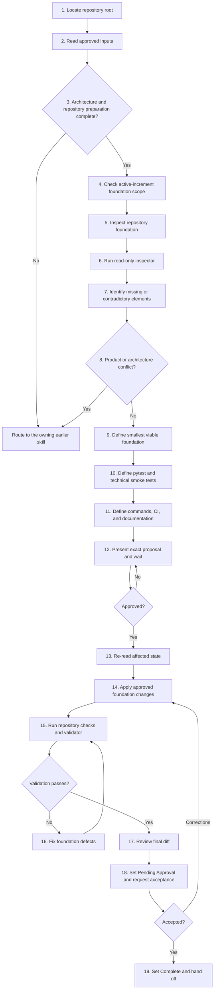

# f-establish-technical-foundation

<!-- Generated by scripts/generate_docs.py. Do not edit by hand. -->

## Summary

Establish or simplify a repository technical foundation after product requirements, architecture, and repository preparation are approved. Use before implementing product issues when the repository needs a reproducible source layout, dependencies, local run commands, pytest and pytest-bdd, quality checks, CI, and concise developer documentation. Require a visible proposal and human approval before local writes, create only technical scaffolding and smoke tests, preserve approved architecture, and never implement user-story behavior or perform remote GitHub actions.

## Repository Source

- [Canonical SKILL.md](https://github.com/ecarrenolozano/ai-sdlc-skills/blob/main/skills/f-establish-technical-foundation/SKILL.md)
- [Skill directory](https://github.com/ecarrenolozano/ai-sdlc-skills/tree/main/skills/f-establish-technical-foundation)

## Resource Overview

| Resource type | Files |
| --- | ---: |
| agents | 1 |
| references | 46 |
| scripts | 3 |
| assets | 5 |

## Operating Process

Multiple process flowchart files exist. The documentation renders `references/process_flowchart.md` first.

Source: [references/process_flowchart.md](https://github.com/ecarrenolozano/ai-sdlc-skills/blob/main/skills/f-establish-technical-foundation/references/process_flowchart.md)

## Process Flowchart

The numbered nodes correspond to the workflow in `SKILL.md`.



## Validation Scripts

- [scripts/inspect_technical_foundation.py](https://github.com/ecarrenolozano/ai-sdlc-skills/blob/main/skills/f-establish-technical-foundation/scripts/inspect_technical_foundation.py)
- [scripts/run_regression_tests.py](https://github.com/ecarrenolozano/ai-sdlc-skills/blob/main/skills/f-establish-technical-foundation/scripts/run_regression_tests.py)
- [scripts/validate_foundation.py](https://github.com/ecarrenolozano/ai-sdlc-skills/blob/main/skills/f-establish-technical-foundation/scripts/validate_foundation.py)

## Reference Material

- [references/completion-gates.md](https://github.com/ecarrenolozano/ai-sdlc-skills/blob/main/skills/f-establish-technical-foundation/references/completion-gates.md)
- [references/foundation-rules.md](https://github.com/ecarrenolozano/ai-sdlc-skills/blob/main/skills/f-establish-technical-foundation/references/foundation-rules.md)
- [references/golden-example/README.md](https://github.com/ecarrenolozano/ai-sdlc-skills/blob/main/skills/f-establish-technical-foundation/references/golden-example/README.md)
- [references/golden-example/browser-task-board/README.md](https://github.com/ecarrenolozano/ai-sdlc-skills/blob/main/skills/f-establish-technical-foundation/references/golden-example/browser-task-board/README.md)
- [references/golden-example/browser-task-board/in-repository/.gitignore](https://github.com/ecarrenolozano/ai-sdlc-skills/blob/main/skills/f-establish-technical-foundation/references/golden-example/browser-task-board/in-repository/.gitignore)
- [references/golden-example/browser-task-board/in-repository/.pre-commit-config.yaml](https://github.com/ecarrenolozano/ai-sdlc-skills/blob/main/skills/f-establish-technical-foundation/references/golden-example/browser-task-board/in-repository/.pre-commit-config.yaml)
- [references/golden-example/browser-task-board/in-repository/pyproject.toml](https://github.com/ecarrenolozano/ai-sdlc-skills/blob/main/skills/f-establish-technical-foundation/references/golden-example/browser-task-board/in-repository/pyproject.toml)
- [references/golden-example/browser-task-board/in-repository/sdlc_docs/00_inception/project_context.md](https://github.com/ecarrenolozano/ai-sdlc-skills/blob/main/skills/f-establish-technical-foundation/references/golden-example/browser-task-board/in-repository/sdlc_docs/00_inception/project_context.md)
- [references/golden-example/browser-task-board/in-repository/sdlc_docs/01_requirements/product_requirements.md](https://github.com/ecarrenolozano/ai-sdlc-skills/blob/main/skills/f-establish-technical-foundation/references/golden-example/browser-task-board/in-repository/sdlc_docs/01_requirements/product_requirements.md)
- [references/golden-example/browser-task-board/in-repository/sdlc_docs/02_architecture/adr/ADR-001-browser-local-persistence-boundary.md](https://github.com/ecarrenolozano/ai-sdlc-skills/blob/main/skills/f-establish-technical-foundation/references/golden-example/browser-task-board/in-repository/sdlc_docs/02_architecture/adr/ADR-001-browser-local-persistence-boundary.md)
- [references/golden-example/browser-task-board/in-repository/sdlc_docs/02_architecture/adr/ADR-002-separate-browser-frontend-from-flask-backend.md](https://github.com/ecarrenolozano/ai-sdlc-skills/blob/main/skills/f-establish-technical-foundation/references/golden-example/browser-task-board/in-repository/sdlc_docs/02_architecture/adr/ADR-002-separate-browser-frontend-from-flask-backend.md)
- [references/golden-example/browser-task-board/in-repository/sdlc_docs/02_architecture/adr/ADR-003-localhost-only-personal-deployment.md](https://github.com/ecarrenolozano/ai-sdlc-skills/blob/main/skills/f-establish-technical-foundation/references/golden-example/browser-task-board/in-repository/sdlc_docs/02_architecture/adr/ADR-003-localhost-only-personal-deployment.md)
- [references/golden-example/browser-task-board/in-repository/sdlc_docs/02_architecture/adr/README.md](https://github.com/ecarrenolozano/ai-sdlc-skills/blob/main/skills/f-establish-technical-foundation/references/golden-example/browser-task-board/in-repository/sdlc_docs/02_architecture/adr/README.md)
- [references/golden-example/browser-task-board/in-repository/sdlc_docs/02_architecture/architecture.md](https://github.com/ecarrenolozano/ai-sdlc-skills/blob/main/skills/f-establish-technical-foundation/references/golden-example/browser-task-board/in-repository/sdlc_docs/02_architecture/architecture.md)
- [references/golden-example/browser-task-board/in-repository/sdlc_docs/trace_workflow.md](https://github.com/ecarrenolozano/ai-sdlc-skills/blob/main/skills/f-establish-technical-foundation/references/golden-example/browser-task-board/in-repository/sdlc_docs/trace_workflow.md)
- [references/golden-example/browser-task-board/in-repository/src/todo_board_ssc/__init__.py](https://github.com/ecarrenolozano/ai-sdlc-skills/blob/main/skills/f-establish-technical-foundation/references/golden-example/browser-task-board/in-repository/src/todo_board_ssc/__init__.py)
- [references/golden-example/browser-task-board/in-repository/tests/conftest.py](https://github.com/ecarrenolozano/ai-sdlc-skills/blob/main/skills/f-establish-technical-foundation/references/golden-example/browser-task-board/in-repository/tests/conftest.py)
- [references/golden-example/browser-task-board/in-repository/uv.lock](https://github.com/ecarrenolozano/ai-sdlc-skills/blob/main/skills/f-establish-technical-foundation/references/golden-example/browser-task-board/in-repository/uv.lock)
- [references/golden-example/browser-task-board/out-proposal.md](https://github.com/ecarrenolozano/ai-sdlc-skills/blob/main/skills/f-establish-technical-foundation/references/golden-example/browser-task-board/out-proposal.md)
- [references/golden-example/browser-task-board/out-repository/.github/workflows/quality.yml](https://github.com/ecarrenolozano/ai-sdlc-skills/blob/main/skills/f-establish-technical-foundation/references/golden-example/browser-task-board/out-repository/.github/workflows/quality.yml)
- [references/golden-example/browser-task-board/out-repository/.gitignore](https://github.com/ecarrenolozano/ai-sdlc-skills/blob/main/skills/f-establish-technical-foundation/references/golden-example/browser-task-board/out-repository/.gitignore)
- [references/golden-example/browser-task-board/out-repository/.pre-commit-config.yaml](https://github.com/ecarrenolozano/ai-sdlc-skills/blob/main/skills/f-establish-technical-foundation/references/golden-example/browser-task-board/out-repository/.pre-commit-config.yaml)
- [references/golden-example/browser-task-board/out-repository/README.md](https://github.com/ecarrenolozano/ai-sdlc-skills/blob/main/skills/f-establish-technical-foundation/references/golden-example/browser-task-board/out-repository/README.md)
- [references/golden-example/browser-task-board/out-repository/docs/development.md](https://github.com/ecarrenolozano/ai-sdlc-skills/blob/main/skills/f-establish-technical-foundation/references/golden-example/browser-task-board/out-repository/docs/development.md)
- [references/golden-example/browser-task-board/out-repository/frontend/static/css/.gitkeep](https://github.com/ecarrenolozano/ai-sdlc-skills/blob/main/skills/f-establish-technical-foundation/references/golden-example/browser-task-board/out-repository/frontend/static/css/.gitkeep)
- [references/golden-example/browser-task-board/out-repository/frontend/static/js/.gitkeep](https://github.com/ecarrenolozano/ai-sdlc-skills/blob/main/skills/f-establish-technical-foundation/references/golden-example/browser-task-board/out-repository/frontend/static/js/.gitkeep)
- [references/golden-example/browser-task-board/out-repository/frontend/templates/.gitkeep](https://github.com/ecarrenolozano/ai-sdlc-skills/blob/main/skills/f-establish-technical-foundation/references/golden-example/browser-task-board/out-repository/frontend/templates/.gitkeep)
- [references/golden-example/browser-task-board/out-repository/pyproject.toml](https://github.com/ecarrenolozano/ai-sdlc-skills/blob/main/skills/f-establish-technical-foundation/references/golden-example/browser-task-board/out-repository/pyproject.toml)
- [references/golden-example/browser-task-board/out-repository/sdlc_docs/02_architecture/architecture.md](https://github.com/ecarrenolozano/ai-sdlc-skills/blob/main/skills/f-establish-technical-foundation/references/golden-example/browser-task-board/out-repository/sdlc_docs/02_architecture/architecture.md)
- [references/golden-example/browser-task-board/out-repository/sdlc_docs/trace_workflow.md](https://github.com/ecarrenolozano/ai-sdlc-skills/blob/main/skills/f-establish-technical-foundation/references/golden-example/browser-task-board/out-repository/sdlc_docs/trace_workflow.md)
- [references/golden-example/browser-task-board/out-repository/src/todo_board_ssc/__init__.py](https://github.com/ecarrenolozano/ai-sdlc-skills/blob/main/skills/f-establish-technical-foundation/references/golden-example/browser-task-board/out-repository/src/todo_board_ssc/__init__.py)
- [references/golden-example/browser-task-board/out-repository/src/todo_board_ssc/backend/__init__.py](https://github.com/ecarrenolozano/ai-sdlc-skills/blob/main/skills/f-establish-technical-foundation/references/golden-example/browser-task-board/out-repository/src/todo_board_ssc/backend/__init__.py)
- [references/golden-example/browser-task-board/out-repository/src/todo_board_ssc/backend/__main__.py](https://github.com/ecarrenolozano/ai-sdlc-skills/blob/main/skills/f-establish-technical-foundation/references/golden-example/browser-task-board/out-repository/src/todo_board_ssc/backend/__main__.py)
- [references/golden-example/browser-task-board/out-repository/src/todo_board_ssc/backend/app.py](https://github.com/ecarrenolozano/ai-sdlc-skills/blob/main/skills/f-establish-technical-foundation/references/golden-example/browser-task-board/out-repository/src/todo_board_ssc/backend/app.py)
- [references/golden-example/browser-task-board/out-repository/src/todo_board_ssc/backend/runtime.py](https://github.com/ecarrenolozano/ai-sdlc-skills/blob/main/skills/f-establish-technical-foundation/references/golden-example/browser-task-board/out-repository/src/todo_board_ssc/backend/runtime.py)
- [references/golden-example/browser-task-board/out-repository/tests/README.md](https://github.com/ecarrenolozano/ai-sdlc-skills/blob/main/skills/f-establish-technical-foundation/references/golden-example/browser-task-board/out-repository/tests/README.md)
- [references/golden-example/browser-task-board/out-repository/tests/conftest.py](https://github.com/ecarrenolozano/ai-sdlc-skills/blob/main/skills/f-establish-technical-foundation/references/golden-example/browser-task-board/out-repository/tests/conftest.py)
- [references/golden-example/browser-task-board/out-repository/tests/integration/todo_board_ssc/backend/test_app.py](https://github.com/ecarrenolozano/ai-sdlc-skills/blob/main/skills/f-establish-technical-foundation/references/golden-example/browser-task-board/out-repository/tests/integration/todo_board_ssc/backend/test_app.py)
- [references/golden-example/browser-task-board/out-repository/tests/regression/.gitkeep](https://github.com/ecarrenolozano/ai-sdlc-skills/blob/main/skills/f-establish-technical-foundation/references/golden-example/browser-task-board/out-repository/tests/regression/.gitkeep)
- [references/golden-example/browser-task-board/out-repository/tests/unit/todo_board_ssc/backend/test_runtime.py](https://github.com/ecarrenolozano/ai-sdlc-skills/blob/main/skills/f-establish-technical-foundation/references/golden-example/browser-task-board/out-repository/tests/unit/todo_board_ssc/backend/test_runtime.py)
- [references/golden-example/browser-task-board/out-repository/tests/validation/features/.gitkeep](https://github.com/ecarrenolozano/ai-sdlc-skills/blob/main/skills/f-establish-technical-foundation/references/golden-example/browser-task-board/out-repository/tests/validation/features/.gitkeep)
- [references/golden-example/browser-task-board/out-repository/tests/validation/steps/.gitkeep](https://github.com/ecarrenolozano/ai-sdlc-skills/blob/main/skills/f-establish-technical-foundation/references/golden-example/browser-task-board/out-repository/tests/validation/steps/.gitkeep)
- [references/golden-example/browser-task-board/out-repository/uv.lock](https://github.com/ecarrenolozano/ai-sdlc-skills/blob/main/skills/f-establish-technical-foundation/references/golden-example/browser-task-board/out-repository/uv.lock)
- [references/process-flowchart.md](https://github.com/ecarrenolozano/ai-sdlc-skills/blob/main/skills/f-establish-technical-foundation/references/process-flowchart.md)
- [references/process_flowchart.md](https://github.com/ecarrenolozano/ai-sdlc-skills/blob/main/skills/f-establish-technical-foundation/references/process_flowchart.md)
- [references/pytest-policy.md](https://github.com/ecarrenolozano/ai-sdlc-skills/blob/main/skills/f-establish-technical-foundation/references/pytest-policy.md)

## Agent Configuration

- [agents/openai.yaml](https://github.com/ecarrenolozano/ai-sdlc-skills/blob/main/skills/f-establish-technical-foundation/agents/openai.yaml)

## Assets

- [assets/bdd_feature_template.feature](https://github.com/ecarrenolozano/ai-sdlc-skills/blob/main/skills/f-establish-technical-foundation/assets/bdd_feature_template.feature)
- [assets/integration_test_template.py](https://github.com/ecarrenolozano/ai-sdlc-skills/blob/main/skills/f-establish-technical-foundation/assets/integration_test_template.py)
- [assets/regression_test_template.py](https://github.com/ecarrenolozano/ai-sdlc-skills/blob/main/skills/f-establish-technical-foundation/assets/regression_test_template.py)
- [assets/test_bdd_scenario_template.py](https://github.com/ecarrenolozano/ai-sdlc-skills/blob/main/skills/f-establish-technical-foundation/assets/test_bdd_scenario_template.py)
- [assets/unit_test_template.py](https://github.com/ecarrenolozano/ai-sdlc-skills/blob/main/skills/f-establish-technical-foundation/assets/unit_test_template.py)

## Golden Examples

- [references/golden-example/README.md](https://github.com/ecarrenolozano/ai-sdlc-skills/blob/main/skills/f-establish-technical-foundation/references/golden-example/README.md)
- [references/golden-example/browser-task-board/README.md](https://github.com/ecarrenolozano/ai-sdlc-skills/blob/main/skills/f-establish-technical-foundation/references/golden-example/browser-task-board/README.md)
- [references/golden-example/browser-task-board/in-repository/.gitignore](https://github.com/ecarrenolozano/ai-sdlc-skills/blob/main/skills/f-establish-technical-foundation/references/golden-example/browser-task-board/in-repository/.gitignore)
- [references/golden-example/browser-task-board/in-repository/.pre-commit-config.yaml](https://github.com/ecarrenolozano/ai-sdlc-skills/blob/main/skills/f-establish-technical-foundation/references/golden-example/browser-task-board/in-repository/.pre-commit-config.yaml)
- [references/golden-example/browser-task-board/in-repository/pyproject.toml](https://github.com/ecarrenolozano/ai-sdlc-skills/blob/main/skills/f-establish-technical-foundation/references/golden-example/browser-task-board/in-repository/pyproject.toml)
- [references/golden-example/browser-task-board/in-repository/sdlc_docs/00_inception/project_context.md](https://github.com/ecarrenolozano/ai-sdlc-skills/blob/main/skills/f-establish-technical-foundation/references/golden-example/browser-task-board/in-repository/sdlc_docs/00_inception/project_context.md)
- [references/golden-example/browser-task-board/in-repository/sdlc_docs/01_requirements/product_requirements.md](https://github.com/ecarrenolozano/ai-sdlc-skills/blob/main/skills/f-establish-technical-foundation/references/golden-example/browser-task-board/in-repository/sdlc_docs/01_requirements/product_requirements.md)
- [references/golden-example/browser-task-board/in-repository/sdlc_docs/02_architecture/adr/ADR-001-browser-local-persistence-boundary.md](https://github.com/ecarrenolozano/ai-sdlc-skills/blob/main/skills/f-establish-technical-foundation/references/golden-example/browser-task-board/in-repository/sdlc_docs/02_architecture/adr/ADR-001-browser-local-persistence-boundary.md)
- [references/golden-example/browser-task-board/in-repository/sdlc_docs/02_architecture/adr/ADR-002-separate-browser-frontend-from-flask-backend.md](https://github.com/ecarrenolozano/ai-sdlc-skills/blob/main/skills/f-establish-technical-foundation/references/golden-example/browser-task-board/in-repository/sdlc_docs/02_architecture/adr/ADR-002-separate-browser-frontend-from-flask-backend.md)
- [references/golden-example/browser-task-board/in-repository/sdlc_docs/02_architecture/adr/ADR-003-localhost-only-personal-deployment.md](https://github.com/ecarrenolozano/ai-sdlc-skills/blob/main/skills/f-establish-technical-foundation/references/golden-example/browser-task-board/in-repository/sdlc_docs/02_architecture/adr/ADR-003-localhost-only-personal-deployment.md)
- [references/golden-example/browser-task-board/in-repository/sdlc_docs/02_architecture/adr/README.md](https://github.com/ecarrenolozano/ai-sdlc-skills/blob/main/skills/f-establish-technical-foundation/references/golden-example/browser-task-board/in-repository/sdlc_docs/02_architecture/adr/README.md)
- [references/golden-example/browser-task-board/in-repository/sdlc_docs/02_architecture/architecture.md](https://github.com/ecarrenolozano/ai-sdlc-skills/blob/main/skills/f-establish-technical-foundation/references/golden-example/browser-task-board/in-repository/sdlc_docs/02_architecture/architecture.md)
- [references/golden-example/browser-task-board/in-repository/sdlc_docs/trace_workflow.md](https://github.com/ecarrenolozano/ai-sdlc-skills/blob/main/skills/f-establish-technical-foundation/references/golden-example/browser-task-board/in-repository/sdlc_docs/trace_workflow.md)
- [references/golden-example/browser-task-board/in-repository/src/todo_board_ssc/__init__.py](https://github.com/ecarrenolozano/ai-sdlc-skills/blob/main/skills/f-establish-technical-foundation/references/golden-example/browser-task-board/in-repository/src/todo_board_ssc/__init__.py)
- [references/golden-example/browser-task-board/in-repository/tests/conftest.py](https://github.com/ecarrenolozano/ai-sdlc-skills/blob/main/skills/f-establish-technical-foundation/references/golden-example/browser-task-board/in-repository/tests/conftest.py)
- [references/golden-example/browser-task-board/in-repository/uv.lock](https://github.com/ecarrenolozano/ai-sdlc-skills/blob/main/skills/f-establish-technical-foundation/references/golden-example/browser-task-board/in-repository/uv.lock)
- [references/golden-example/browser-task-board/out-proposal.md](https://github.com/ecarrenolozano/ai-sdlc-skills/blob/main/skills/f-establish-technical-foundation/references/golden-example/browser-task-board/out-proposal.md)
- [references/golden-example/browser-task-board/out-repository/.github/workflows/quality.yml](https://github.com/ecarrenolozano/ai-sdlc-skills/blob/main/skills/f-establish-technical-foundation/references/golden-example/browser-task-board/out-repository/.github/workflows/quality.yml)
- [references/golden-example/browser-task-board/out-repository/.gitignore](https://github.com/ecarrenolozano/ai-sdlc-skills/blob/main/skills/f-establish-technical-foundation/references/golden-example/browser-task-board/out-repository/.gitignore)
- [references/golden-example/browser-task-board/out-repository/.pre-commit-config.yaml](https://github.com/ecarrenolozano/ai-sdlc-skills/blob/main/skills/f-establish-technical-foundation/references/golden-example/browser-task-board/out-repository/.pre-commit-config.yaml)
- [references/golden-example/browser-task-board/out-repository/README.md](https://github.com/ecarrenolozano/ai-sdlc-skills/blob/main/skills/f-establish-technical-foundation/references/golden-example/browser-task-board/out-repository/README.md)
- [references/golden-example/browser-task-board/out-repository/docs/development.md](https://github.com/ecarrenolozano/ai-sdlc-skills/blob/main/skills/f-establish-technical-foundation/references/golden-example/browser-task-board/out-repository/docs/development.md)
- [references/golden-example/browser-task-board/out-repository/frontend/static/css/.gitkeep](https://github.com/ecarrenolozano/ai-sdlc-skills/blob/main/skills/f-establish-technical-foundation/references/golden-example/browser-task-board/out-repository/frontend/static/css/.gitkeep)
- [references/golden-example/browser-task-board/out-repository/frontend/static/js/.gitkeep](https://github.com/ecarrenolozano/ai-sdlc-skills/blob/main/skills/f-establish-technical-foundation/references/golden-example/browser-task-board/out-repository/frontend/static/js/.gitkeep)
- [references/golden-example/browser-task-board/out-repository/frontend/templates/.gitkeep](https://github.com/ecarrenolozano/ai-sdlc-skills/blob/main/skills/f-establish-technical-foundation/references/golden-example/browser-task-board/out-repository/frontend/templates/.gitkeep)
- [references/golden-example/browser-task-board/out-repository/pyproject.toml](https://github.com/ecarrenolozano/ai-sdlc-skills/blob/main/skills/f-establish-technical-foundation/references/golden-example/browser-task-board/out-repository/pyproject.toml)
- [references/golden-example/browser-task-board/out-repository/sdlc_docs/02_architecture/architecture.md](https://github.com/ecarrenolozano/ai-sdlc-skills/blob/main/skills/f-establish-technical-foundation/references/golden-example/browser-task-board/out-repository/sdlc_docs/02_architecture/architecture.md)
- [references/golden-example/browser-task-board/out-repository/sdlc_docs/trace_workflow.md](https://github.com/ecarrenolozano/ai-sdlc-skills/blob/main/skills/f-establish-technical-foundation/references/golden-example/browser-task-board/out-repository/sdlc_docs/trace_workflow.md)
- [references/golden-example/browser-task-board/out-repository/src/todo_board_ssc/__init__.py](https://github.com/ecarrenolozano/ai-sdlc-skills/blob/main/skills/f-establish-technical-foundation/references/golden-example/browser-task-board/out-repository/src/todo_board_ssc/__init__.py)
- [references/golden-example/browser-task-board/out-repository/src/todo_board_ssc/backend/__init__.py](https://github.com/ecarrenolozano/ai-sdlc-skills/blob/main/skills/f-establish-technical-foundation/references/golden-example/browser-task-board/out-repository/src/todo_board_ssc/backend/__init__.py)
- [references/golden-example/browser-task-board/out-repository/src/todo_board_ssc/backend/__main__.py](https://github.com/ecarrenolozano/ai-sdlc-skills/blob/main/skills/f-establish-technical-foundation/references/golden-example/browser-task-board/out-repository/src/todo_board_ssc/backend/__main__.py)
- [references/golden-example/browser-task-board/out-repository/src/todo_board_ssc/backend/app.py](https://github.com/ecarrenolozano/ai-sdlc-skills/blob/main/skills/f-establish-technical-foundation/references/golden-example/browser-task-board/out-repository/src/todo_board_ssc/backend/app.py)
- [references/golden-example/browser-task-board/out-repository/src/todo_board_ssc/backend/runtime.py](https://github.com/ecarrenolozano/ai-sdlc-skills/blob/main/skills/f-establish-technical-foundation/references/golden-example/browser-task-board/out-repository/src/todo_board_ssc/backend/runtime.py)
- [references/golden-example/browser-task-board/out-repository/tests/README.md](https://github.com/ecarrenolozano/ai-sdlc-skills/blob/main/skills/f-establish-technical-foundation/references/golden-example/browser-task-board/out-repository/tests/README.md)
- [references/golden-example/browser-task-board/out-repository/tests/conftest.py](https://github.com/ecarrenolozano/ai-sdlc-skills/blob/main/skills/f-establish-technical-foundation/references/golden-example/browser-task-board/out-repository/tests/conftest.py)
- [references/golden-example/browser-task-board/out-repository/tests/integration/todo_board_ssc/backend/test_app.py](https://github.com/ecarrenolozano/ai-sdlc-skills/blob/main/skills/f-establish-technical-foundation/references/golden-example/browser-task-board/out-repository/tests/integration/todo_board_ssc/backend/test_app.py)
- [references/golden-example/browser-task-board/out-repository/tests/regression/.gitkeep](https://github.com/ecarrenolozano/ai-sdlc-skills/blob/main/skills/f-establish-technical-foundation/references/golden-example/browser-task-board/out-repository/tests/regression/.gitkeep)
- [references/golden-example/browser-task-board/out-repository/tests/unit/todo_board_ssc/backend/test_runtime.py](https://github.com/ecarrenolozano/ai-sdlc-skills/blob/main/skills/f-establish-technical-foundation/references/golden-example/browser-task-board/out-repository/tests/unit/todo_board_ssc/backend/test_runtime.py)
- [references/golden-example/browser-task-board/out-repository/tests/validation/features/.gitkeep](https://github.com/ecarrenolozano/ai-sdlc-skills/blob/main/skills/f-establish-technical-foundation/references/golden-example/browser-task-board/out-repository/tests/validation/features/.gitkeep)
- [references/golden-example/browser-task-board/out-repository/tests/validation/steps/.gitkeep](https://github.com/ecarrenolozano/ai-sdlc-skills/blob/main/skills/f-establish-technical-foundation/references/golden-example/browser-task-board/out-repository/tests/validation/steps/.gitkeep)
- [references/golden-example/browser-task-board/out-repository/uv.lock](https://github.com/ecarrenolozano/ai-sdlc-skills/blob/main/skills/f-establish-technical-foundation/references/golden-example/browser-task-board/out-repository/uv.lock)

## Canonical Skill Definition

The following section is generated from the canonical `SKILL.md` body.


## Establish Technical Foundation

### Purpose

Prepare the smallest repository foundation that lets developers implement approved work safely and reproducibly. Keep the workflow practical: inspect, propose, obtain approval, establish the foundation, validate it, and request final acceptance.

### Core Rules

- Work in English.
- Use the complete identifier `f-establish-technical-foundation`.
- Treat approved Project Context, Product Requirements, Architecture, ADRs, Workflow Traceability, and the current repository as authoritative.
- Start only after Project Context, Product Requirements, Architecture, and Repository preparation are complete.
- Preserve approved product behavior and architecture boundaries.
- Treat foundation completion as scoped to the active approved increment. When a later increment introduces a new runtime, dependency, local command, interface entry point, packaging concern, CI concern, or test structure, preserve prior foundation evidence as history and propose only the smallest foundation update slice needed for the active increment.
- Do not implement user stories, business rules, product APIs, product persistence, or product UI behavior.
- Create only technical scaffolding, configuration, developer commands, CI, and technical smoke tests.
- Prefer existing viable tooling over replacement.
- Use `pytest` for new Python tests and configure `pytest-bdd` for later validation work.
- Require explicit approval of the visible local-change proposal before modifying files.
- Require explicit final acceptance before changing Technical foundation to `Complete`.
- Re-read affected files immediately before writing. Re-propose when relevant state changed.
- Do not install interpreters or dependencies, commit, push, create pull requests, modify issues, or move project items without separate approval.
- Do not create persistent assessment reports or execution logs. Put durable instructions in existing repository documentation.
- Never claim a command passed unless it was executed successfully.

### Canonical Inputs

Read these when present:

```text
sdlc_docs/00_inception/project_context.md
sdlc_docs/01_requirements/product_requirements.md
sdlc_docs/02_architecture/architecture.md
sdlc_docs/02_architecture/adr/
sdlc_docs/trace_workflow.md
README.md
WORKFLOW.md
CONTRIBUTING.md
pyproject.toml or the approved manifest
lockfiles
src/ and other approved source roots
tests/
docs/development.md
.github/workflows/
.pre-commit-config.yaml
```

Run `scripts/inspect_technical_foundation.py` before drafting the proposal.

### Minimum Foundation

Adapt paths to the approved architecture. A typical Python browser application may use:

```text
frontend/
src/<python-package>/
tests/
├── unit/
├── integration/
├── regression/
└── validation/
    ├── features/
    └── steps/
```

Establish only what the repository needs now:

- source boundaries matching the approved architecture;
- dependency and lockfile strategy;
- reproducible install and local run commands;
- pytest and pytest-bdd configuration;
- minimal technical smoke tests;
- linting, formatting, typing, coverage, and build commands when applicable;
- minimal CI using the same commands;
- concise developer and test documentation;
- generated-file exclusions;
- Workflow Traceability updates after approval.

Do not create speculative product packages, empty architecture layers, product scenarios, or fake coverage.

### Pytest Policy

Use the conventions in `references/pytest-policy.md` and the templates in `assets/`.

Keep these primary categories:

- `tests/unit/`: isolated technical or product units.
- `tests/integration/`: collaboration among real components.
- `tests/regression/`: confirmed defects only; create subdirectories later when needed.
- `tests/validation/`: future approved behavior scenarios using pytest-bdd.

During foundation work:

- create only technical smoke tests;
- keep regression and validation categories empty unless real approved content already exists;
- allow scoped `conftest.py` files;
- use the visual module template as guidance, not as a rigid parser contract;
- do not create `unittest.TestCase` tests;
- do not generate product Gherkin scenarios.

### Distribution and Local Execution

Do not turn packaging into a larger problem than the approved scope requires.

When a local browser application is explicitly intended to run from a repository checkout, document that convention clearly. In that case, a successful Python wheel build validates the Python package only and does not need to represent the complete browser application.

When the approved architecture requires an installable or deployable application artifact, route material packaging decisions to `d-design-product-architecture` instead of inventing them here.

The Browser Task Board golden example uses checkout-based local execution.

### Approval Boundaries

#### Local Foundation Proposal

Before changing files, show:

- repository and current state;
- approved constraints;
- proposed source and test structure;
- dependencies and commands;
- files to create, modify, preserve, or remove;
- technical smoke tests;
- CI and documentation changes;
- environment actions requiring developer approval.

Stop and wait for approval.

#### Final Acceptance

After applying and validating the approved changes, show:

- changed files;
- commands and exit codes;
- passed, failed, intentionally empty, or unavailable checks;
- remaining limitations;
- confirmation that no product behavior or remote action was performed.

Keep Technical foundation at `Pending Approval` until the user explicitly accepts the result.

### Workflow

1. Locate the repository root.
2. Read approved context, requirements, architecture, ADRs, and workflow trace.
3. Verify Architecture and Repository preparation are complete.
4. Determine whether the current foundation evidence covers the active approved increment or only historical superseded scope.
5. Inspect manifests, source roots, tests, CI, and developer documentation.
6. Run `scripts/inspect_technical_foundation.py` in read-only mode.
7. Identify only the missing or contradictory foundation elements.
8. Route product ambiguity to `c-manage-product-requirements` and material architecture conflicts to `d-design-product-architecture`.
9. Define the smallest viable foundation using existing approved tooling.
10. Define pytest, pytest-bdd, test categories, and technical smoke tests.
11. Define reproducible commands, quality checks, minimal CI, and concise documentation.
12. Present the exact local-change proposal and stop for approval.
13. Re-read affected files and repository state after approval.
14. Apply only the approved foundation changes without product behavior.
15. Run repository commands and `scripts/validate_foundation.py`.
16. Fix foundation defects without weakening valid tests or checks.
17. Review the final diff against the approved proposal.
18. Set Technical foundation to `Pending Approval` and request final acceptance.
19. After explicit acceptance, set Technical foundation to `Complete` and hand off to `g-implement-repository-work` when installed.

See `references/process-flowchart.md` for the matching visual workflow.

### Validation

Run from the repository root:

```bash
python3 .agents/skills/f-establish-technical-foundation/scripts/validate_foundation.py .
```

Also run the commands declared by the repository. A typical uv-based project uses:

```bash
uv sync --locked --all-groups
uv run pytest --collect-only
uv run pytest tests/unit
uv run pytest tests/integration
uv run ruff check .
uv run ruff format --check .
uv run mypy src
uv build
```

Report intentionally empty categories accurately. Do not add fake tests merely to avoid pytest exit code 5.

Use `uv lock` followed by `uv sync --all-groups` only for a deliberate dependency update.

### Completion Gate

Use `references/completion-gates.md`. The foundation is ready only when:

- approved architecture boundaries are represented;
- installation and local execution are documented;
- pytest and pytest-bdd are configured;
- required test categories exist;
- technical smoke tests and configured quality checks pass;
- CI uses the documented reproducible commands;
- developer documentation is sufficient to start work;
- no product story was implemented;
- final human acceptance was received.

### Resources

Read only when needed:

- `references/foundation-rules.md`
- `references/pytest-policy.md`
- `references/completion-gates.md`
- `references/process-flowchart.md`
- `references/golden-example/browser-task-board/README.md`
- `assets/unit_test_template.py`
- `assets/integration_test_template.py`
- `assets/regression_test_template.py`
- `assets/bdd_feature_template.feature`
- `assets/test_bdd_scenario_template.py`

### Handoffs

- Product behavior ambiguity -> `c-manage-product-requirements`.
- Material architecture conflict -> `d-design-product-architecture`.
- GitHub issue mismatch -> `e-sync-repository-requirements`.
- Accepted technical foundation -> `g-implement-repository-work` when installed.

Never invoke another skill automatically.


### Progressive Audit Resources

- Read `references/golden-example/README.md` only when a progressive concrete example is useful.
- Read `references/process_flowchart.md` only for human explanation or audit.
