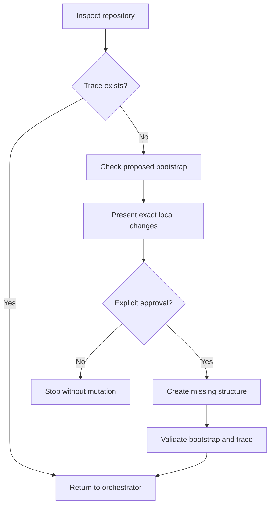

# sdlc-bootstrap-project

<!-- Generated by scripts/generate_docs.py. Do not edit by hand. -->

## Summary

Initialize the minimum controlled-SDLC structure for a Python repository when sdlc_docs/trace_workflow.md is absent. Use only through the SDLC orchestrator or when the developer explicitly asks to initialize the workflow. Inspect existing repository state, propose the local files to create, require explicit approval, create the canonical trace and inception folders without inventing requirements or architecture, validate the result, and return control to the orchestrator.

## Repository Source

- [Canonical SKILL.md](https://github.com/ecarrenolozano/ai-sdlc-skills/blob/main/skills/sdlc-bootstrap-project/SKILL.md)
- [Skill directory](https://github.com/ecarrenolozano/ai-sdlc-skills/tree/main/skills/sdlc-bootstrap-project)

## Resource Overview

| Resource type | Files |
| --- | ---: |
| agents | 1 |
| references | 2 |
| scripts | 1 |
| assets | 0 |

## Operating Process

Source: [references/process_flowchart.md](https://github.com/ecarrenolozano/ai-sdlc-skills/blob/main/skills/sdlc-bootstrap-project/references/process_flowchart.md)

## Process Flowchart

## Validation Scripts

- [scripts/bootstrap_sdlc.py](https://github.com/ecarrenolozano/ai-sdlc-skills/blob/main/skills/sdlc-bootstrap-project/scripts/bootstrap_sdlc.py)

## Reference Material

- [references/golden-example/README.md](https://github.com/ecarrenolozano/ai-sdlc-skills/blob/main/skills/sdlc-bootstrap-project/references/golden-example/README.md)
- [references/process_flowchart.md](https://github.com/ecarrenolozano/ai-sdlc-skills/blob/main/skills/sdlc-bootstrap-project/references/process_flowchart.md)

## Agent Configuration

- [agents/openai.yaml](https://github.com/ecarrenolozano/ai-sdlc-skills/blob/main/skills/sdlc-bootstrap-project/agents/openai.yaml)

## Assets

No files.

## Golden Examples

- [references/golden-example/README.md](https://github.com/ecarrenolozano/ai-sdlc-skills/blob/main/skills/sdlc-bootstrap-project/references/golden-example/README.md)

## Canonical Skill Definition

The following section is generated from the canonical `SKILL.md` body.

## SDLC Project Bootstrap

### Purpose

Create only the structural files required for the orchestrator to guide a new or existing Python project. Never infer product decisions, approvals, evidence, architecture, implementation status, or remote state.

### Preconditions

- Locate the repository root and inspect existing `sdlc_docs`, Python metadata, source, tests, and version-control state.
- Stop if `sdlc_docs/trace_workflow.md` already exists; return control to the orchestrator.
- Keep all approval boundaries unchanged.

### Workflow

1. Inspect the repository without mutation.
2. Run `scripts/bootstrap_sdlc.py --check <repository-root>`.
3. Present the exact local directories and files proposed for creation.
4. Require explicit approval before writing.
5. Re-inspect the target paths after approval.
6. Run `scripts/bootstrap_sdlc.py --apply <repository-root>`.
7. Run `scripts/bootstrap_sdlc.py --check <repository-root>` and the orchestrator trace validator.
8. Report created files and preserved files, then invoke or recommend the orchestrator in plain language.

### Boundaries

- Do not overwrite existing files.
- Do not change source code, tests, dependency files, Git state, GitHub state, requirements, architecture, or approvals.
- Do not mark any lifecycle stage complete.
- Do not expose internal skill identifiers unless troubleshooting requires them.

### Resources

- Read `references/golden-example/README.md` only when a concrete bootstrap example is useful.
- Read `references/process_flowchart.md` only for human explanation or audit.
- Run `scripts/bootstrap_sdlc.py` for every check or mutation.
