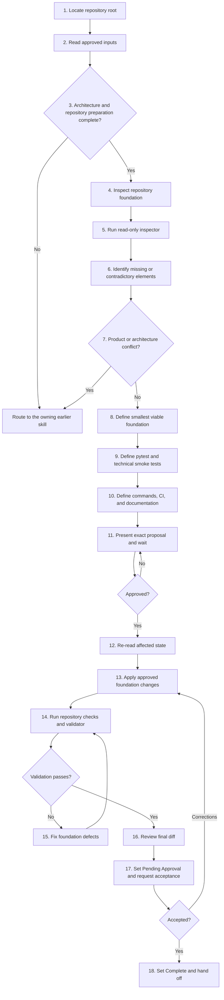

# Process Flowchart

The numbered nodes correspond to the workflow in `SKILL.md`.

```mermaid
flowchart TD
    S01[1. Locate repository root] --> S02[2. Read approved inputs]
    S02 --> S03{3. Architecture and repository preparation complete?}
    S03 -- No --> H01[Route to the owning earlier skill]
    S03 -- Yes --> S04[4. Inspect repository foundation]
    S04 --> S05[5. Run read-only inspector]
    S05 --> S06[6. Identify missing or contradictory elements]
    S06 --> S07{7. Product or architecture conflict?}
    S07 -- Yes --> H01
    S07 -- No --> S08[8. Define smallest viable foundation]
    S08 --> S09[9. Define pytest and technical smoke tests]
    S09 --> S10[10. Define commands, CI, and documentation]
    S10 --> S11[11. Present exact proposal and wait]
    S11 --> A01{Approved?}
    A01 -- No --> S11
    A01 -- Yes --> S12[12. Re-read affected state]
    S12 --> S13[13. Apply approved foundation changes]
    S13 --> S14[14. Run repository checks and validator]
    S14 --> V01{Validation passes?}
    V01 -- No --> S15[15. Fix foundation defects]
    S15 --> S14
    V01 -- Yes --> S16[16. Review final diff]
    S16 --> S17[17. Set Pending Approval and request acceptance]
    S17 --> A02{Accepted?}
    A02 -- Corrections --> S13
    A02 -- Yes --> S18[18. Set Complete and hand off]
```
